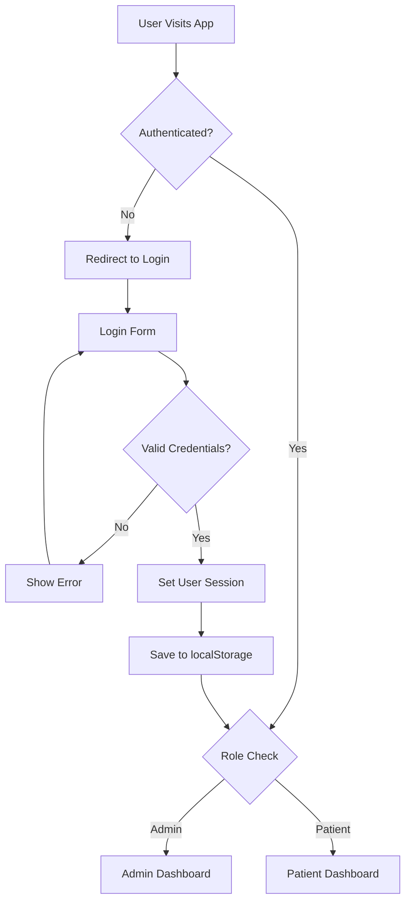
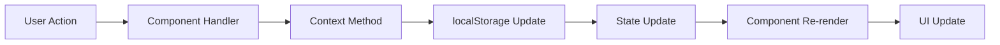

# Dental Center Management Dashboard

A comprehensive React-based dental center management system with role-based authentication, patient management, appointment scheduling, and file handling capabilities.

## 📋 Table of Contents

- [Overview](#overview)
- [Live Demo](#live-demo)
- [Features](#features)
- [Tech Stack](#tech-stack)
- [Architecture](#architecture)
- [Installation & Setup](#installation--setup)
- [Code Structure](#code-structure)
- [Component Documentation](#component-documentation)
- [State Management](#state-management)
- [Data Flow](#data-flow)
- [Authentication System](#authentication-system)
- [File Management](#file-management)
- [API Reference](#api-reference)
- [UI/UX Design](#uiux-design)
- [Testing](#testing)
- [Deployment](#deployment)
- [Troubleshooting](#troubleshooting)
- [Contributing](#contributing)

## 🎯 Overview

This is a full-featured dental center management system built with React that simulates a real-world medical practice management application. The system supports two user roles (Admin/Dentist and Patient) with different access levels and capabilities.

### Key Capabilities:
- **Admin Users**: Full system access including patient management, appointment scheduling, calendar view, and file management
- **Patient Users**: Personal dashboard with appointment history, upcoming appointments, and access to treatment files
- **Data Persistence**: All data stored in localStorage to simulate backend functionality
- **File Handling**: Upload and download functionality for treatment documents, invoices, and medical images

## 🚀 Live Demo

- **Deployed Application**: [https://dental-center-dashboard-one.vercel.app/]
- **GitHub Repository**: [Your GitHub Repository URL Here]

### Demo Credentials:

## 📋 Features

### Authentication System
- Role-based authentication (Admin/Patient)
- Session persistence with localStorage
- Protected routes based on user roles

### Admin Features
- **Dashboard**: KPIs, upcoming appointments, top patients, revenue tracking
- **Patient Management**: Add, edit, delete patient records
- **Appointment Management**: Schedule, update appointments with file uploads
- **Calendar View**: Monthly view with appointment scheduling
- **File Management**: Upload and manage treatment files (invoices, X-rays, etc.)

### Patient Features
- **Personal Dashboard**: View upcoming appointments and treatment history
- **Profile Management**: View personal information and health records
- **File Access**: Download treatment files and invoices

### Technical Features
- Fully responsive design
- File upload with base64 storage
- Search and filter functionality
- Form validation
- Real-time data updates
- Modern UI with TailwindCSS

## 🛠️ Tech Stack

- **Frontend**: React 18, Functional Components
- **Routing**: React Router DOM
- **State Management**: Context API
- **Styling**: TailwindCSS
- **Icons**: Lucide React
- **Storage**: localStorage (simulating backend)

## 🛠️ Project Structure 

## 📋 Installation & Setup

### Prerequisites
- Node.js (v14.0.0 or higher)
- npm (v6.0.0 or higher) or yarn (v1.22.0 or higher)
- Modern web browser with localStorage support

### Step-by-Step Installation

1. **Clone the Repository**
```bash
git clone https://github.com/your-username/dental-center-dashboard.git
cd dental-center-dashboard
```

2. **Install Dependencies**
```bash
npm install
# or
yarn install
```

3. **Install Required Packages**
```bash
npm install react react-dom react-router-dom lucide-react
npm install -D tailwindcss postcss autoprefixer
```

4. **Initialize TailwindCSS**
```bash
npx tailwindcss init -p
```

5. **Start Development Server**
```bash
npm start
# or
yarn start
```

6. **Build for Production**
```bash
npm run build
# or
yarn build
```

## 📁 Code Structure

### Project Directory Structure
```
dental-center-dashboard/
├── public/
│   ├── index.html              # Main HTML template
│   └── favicon.ico             # Application icon
├── src/
│   ├── components/             # Reusable UI components
│   │   ├── Header.js          # Navigation header component
│   │   ├── Layout.js          # Main layout wrapper
│   │   ├── Modal.js           # Reusable modal component
│   │   ├── ProtectedRoute.js  # Route protection component
│   │   └── Sidebar.js         # Navigation sidebar component
│   ├── context/               # React Context providers
│   │   ├── AuthContext.js     # Authentication state management
│   │   └── DataContext.js     # Application data management
│   ├── pages/                 # Page components
│   │   ├── Calendar.js        # Calendar view page
│   │   ├── Dashboard.js       # Main dashboard page
│   │   ├── Incidents.js       # Appointment management page
│   │   ├── Login.js           # Login page
│   │   ├── PatientView.js     # Patient portal page
│   │   └── Patients.js        # Patient management page
│   ├── App.js                 # Main application component
│   ├── index.js               # Application entry point
│   └── index.css              # Global styles and Tailwind imports
├── package.json               # Project dependencies and scripts
├── tailwind.config.js         # TailwindCSS configuration
├── postcss.config.js          # PostCSS configuration
└── README.md                  # Project documentation
```

## 🧩 Component Documentation

### Core Components

#### `src/App.js`
**Purpose**: Main application component that sets up routing and context providers.

```javascript
// Key responsibilities:
// 1. Wrap application with context providers
// 2. Define routing structure
// 3. Handle protected routes
// 4. Provide global layout structure

const App = () => {
  return (
    <AuthProvider>
      <DataProvider>
        <Router>
          {/* Route definitions */}
        </Router>
      </DataProvider>
    </AuthProvider>
  );
};
```

#### `src/components/Layout.js`
**Purpose**: Provides the main layout structure for authenticated pages.

```javascript
// Features:
// - Responsive sidebar navigation
// - Header with user information
// - Main content area
// - Consistent layout across all pages

const Layout = () => {
  return (
    <div className="flex h-screen bg-gray-100">
      <Sidebar />
      <div className="flex-1 flex flex-col overflow-hidden">
        <Header />
        <main className="flex-1 overflow-x-hidden overflow-y-auto bg-gray-50 p-6">
          <Outlet /> {/* Child routes render here */}
        </main>
      </div>
    </div>
  );
};
```

#### `src/components/ProtectedRoute.js`
**Purpose**: Handles route protection based on authentication and user roles.

```javascript
// Functionality:
// - Check user authentication status
// - Verify user role permissions
// - Redirect to login if not authenticated
// - Redirect to dashboard if insufficient permissions

const ProtectedRoute = ({ children, requiredRole = null }) => {
  const { user, loading } = useAuth();
  
  // Authentication checks
  if (loading) return <LoadingSpinner />;
  if (!user) return <Navigate to="/login" replace />;
  if (requiredRole && user.role !== requiredRole) {
    return <Navigate to="/dashboard" replace />;
  }
  
  return children;
};
```

#### `src/components/Modal.js`
**Purpose**: Reusable modal component for forms and dialogs.

```javascript
// Features:
// - Backdrop click to close
// - Escape key handling
// - Responsive design
// - Customizable content

const Modal = ({ isOpen, onClose, title, children }) => {
  if (!isOpen) return null;
  
  return (
    <div className="fixed inset-0 bg-black bg-opacity-50 flex items-center justify-center z-50">
      <div className="bg-white rounded-lg shadow-xl max-w-2xl w-full mx-4">
        {/* Modal content */}
      </div>
    </div>
  );
};
```

### Page Components

#### `src/pages/Dashboard.js`
**Purpose**: Main dashboard displaying KPIs and overview information.

```javascript
// Admin Dashboard Features:
// - Total patients count
// - Revenue calculations
// - Completed/pending treatments
// - Upcoming appointments list
// - Top patients by appointment count

// Patient Dashboard Features:
// - Personal appointment statistics
// - Upcoming appointments
// - Recent treatment history
// - Quick access to key information

const Dashboard = () => {
  const { user } = useAuth();
  const { patients, incidents } = useData();
  
  // Calculate KPIs
  const totalPatients = patients.length;
  const totalRevenue = incidents
    .filter(i => i.status === 'Completed' && i.cost)
    .reduce((sum, i) => sum + (i.cost || 0), 0);
  
  // Render different dashboards based on user role
  return user.role === 'Admin' ? <AdminDashboard /> : <PatientDashboard />;
};
```

#### `src/pages/Patients.js`
**Purpose**: Patient management interface for admin users.

```javascript
// Features:
// - Patient list with search and filtering
// - Add new patient form
// - Edit existing patient information
// - Delete patients with confirmation
// - Patient statistics and appointment counts

const Patients = () => {
  const { patients, addPatient, updatePatient, deletePatient } = useData();
  
  // CRUD operations
  const handleSubmit = (formData) => {
    if (editingPatient) {
      updatePatient(editingPatient.id, formData);
    } else {
      addPatient(formData);
    }
  };
  
  return (
    <div>
      {/* Search and filter UI */}
      {/* Patient table */}
      {/* Add/Edit modal */}
    </div>
  );
};
```

#### `src/pages/Incidents.js`
**Purpose**: Appointment management interface for admin users.

```javascript
// Features:
// - Appointment list with filtering by status
// - Create new appointments
// - Edit appointment details
// - File upload for treatment documents
// - Status management (Scheduled/Completed/Cancelled)
// - Cost and treatment information

const Incidents = () => {
  const { incidents, addIncident, updateIncident, deleteIncident } = useData();
  
  // File upload handling
  const handleFileUpload = (e) => {
    const files = Array.from(e.target.files);
    files.forEach(file => {
      const reader = new FileReader();
      reader.onload = (event) => {
        const newFile = {
          name: file.name,
          url: event.target.result, // Base64 data URL
          size: file.size,
          type: file.type
        };
        setFormData(prev => ({
          ...prev,
          files: [...prev.files, newFile]
        }));
      };
      reader.readAsDataURL(file);
    });
  };
  
  return (
    <div>
      {/* Appointment management interface */}
    </div>
  );
};
```

#### `src/pages/Calendar.js`
**Purpose**: Calendar view for appointment scheduling and overview.

```javascript
// Features:
// - Monthly calendar grid
// - Appointment visualization
// - Date selection for detailed view
// - Appointment status color coding
// - Responsive design for mobile

const Calendar = () => {
  const [currentDate, setCurrentDate] = useState(new Date());
  const [selectedDate, setSelectedDate] = useState(null);
  
  // Calendar calculations
  const getDaysInMonth = (date) => {
    // Generate calendar grid with proper week structure
  };
  
  const getAppointmentsForDate = (date) => {
    return incidents.filter(incident => {
      const appointmentDate = new Date(incident.appointmentDate);
      return appointmentDate.toDateString() === date.toDateString();
    });
  };
  
  return (
    <div>
      {/* Calendar navigation */}
      {/* Calendar grid */}
      {/* Selected date details */}
    </div>
  );
};
```

## 🔄 State Management

### Context API Architecture

The application uses React Context API for state management, providing a centralized way to manage authentication and data across components.

#### AuthContext (`src/context/AuthContext.js`)

```javascript
// State Management:
// - Current user information
// - Authentication status
// - Login/logout functionality
// - Session persistence

const AuthContext = createContext();

export const AuthProvider = ({ children }) => {
  const [user, setUser] = useState(null);
  const [loading, setLoading] = useState(true);
  
  // Initialize user from localStorage
  useEffect(() => {
    const savedUser = localStorage.getItem('currentUser');
    if (savedUser) {
      setUser(JSON.parse(savedUser));
    }
    setLoading(false);
  }, []);
  
  // Login functionality
  const login = (email, password) => {
    const users = JSON.parse(localStorage.getItem('users') || '[]');
    const foundUser = users.find(u => u.email === email && u.password === password);
    
    if (foundUser) {
      setUser(foundUser);
      localStorage.setItem('currentUser', JSON.stringify(foundUser));
      return { success: true };
    }
    return { success: false, error: 'Invalid credentials' };
  };
  
  // Logout functionality
  const logout = () => {
    setUser(null);
    localStorage.removeItem('currentUser');
  };
  
  return (
    <AuthContext.Provider value={{ user, login, logout, loading }}>
      {children}
    </AuthContext.Provider>
  );
};

// Custom hook for using auth context
export const useAuth = () => {
  const context = useContext(AuthContext);
  if (!context) {
    throw new Error('useAuth must be used within an AuthProvider');
  }
  return context;
};
```

#### DataContext (`src/context/DataContext.js`)

```javascript
// Data Management:
// - Patient records
// - Appointment/incident records
// - CRUD operations
// - Data persistence

const DataContext = createContext();

export const DataProvider = ({ children }) => {
  const [patients, setPatients] = useState([]);
  const [incidents, setIncidents] = useState([]);
  
  // Initialize data from localStorage
  useEffect(() => {
    initializeData();
    loadData();
  }, []);
  
  // Data initialization with mock data
  const initializeData = () => {
    const mockData = {
      users: [
        { id: "1", role: "Admin", email: "admin@entnt.in", password: "admin123", name: "Dr. Smith" },
        { id: "2", role: "Patient", email: "john@entnt.in", password: "patient123", patientId: "p1", name: "John Doe" }
      ],
      patients: [
        {
          id: "p1",
          name: "John Doe",
          dob: "1990-05-10",
          contact: "1234567890",
          email: "john@entnt.in",
          healthInfo: "No allergies"
        }
      ],
      incidents: [
        {
          id: "i1",
          patientId: "p1",
          title: "Toothache",
          description: "Upper molar pain",
          appointmentDate: "2025-01-15T10:00:00",
          status: "Scheduled",
          files: []
        }
      ]
    };
    
    // Initialize localStorage if empty
    if (!localStorage.getItem('users')) {
      localStorage.setItem('users', JSON.stringify(mockData.users));
    }
    // ... initialize other data
  };
  
  // CRUD Operations
  const addPatient = (patient) => {
    const newPatient = {
      ...patient,
      id: 'p' + Date.now(),
      createdAt: new Date().toISOString()
    };
    const updatedPatients = [...patients, newPatient];
    savePatients(updatedPatients);
    return newPatient;
  };
  
  // ... other CRUD operations
  
  return (
    <DataContext.Provider value={{
      patients, incidents,
      addPatient, updatePatient, deletePatient,
      addIncident, updateIncident, deleteIncident
    }}>
      {children}
    </DataContext.Provider>
  );
};
```

## 🔐 Authentication System

### Authentication Flow



### Login Process

1. **User Input**: Email and password entered
2. **Validation**: Credentials checked against stored users
3. **Session Creation**: User object stored in context and localStorage
4. **Route Protection**: User redirected based on role
5. **Persistence**: Session maintained across browser refreshes

### Role-Based Access Control

```javascript
// Route protection based on user roles
const ProtectedRoute = ({ children, requiredRole = null }) => {
  const { user, loading } = useAuth();
  
  // Loading state
  if (loading) {
    return <LoadingSpinner />;
  }
  
  // Not authenticated
  if (!user) {
    return <Navigate to="/login" replace />;
  }
  
  // Role-based access control
  if (requiredRole && user.role !== requiredRole) {
    return <Navigate to="/dashboard" replace />;
  }
  
  return children;
};
```

## 📁 File Management

### File Upload Process

```javascript
// File upload with base64 encoding
const handleFileUpload = (e) => {
  const files = Array.from(e.target.files);
  
  files.forEach(file => {
    // Validate file type and size
    if (!isValidFile(file)) {
      alert('Invalid file type or size');
      return;
    }
    
    const reader = new FileReader();
    reader.onload = (event) => {
      const newFile = {
        name: file.name,
        url: event.target.result, // Base64 data URL
        size: file.size,
        type: file.type,
        uploadDate: new Date().toISOString()
      };
      
      // Update form data with new file
      setFormData(prev => ({
        ...prev,
        files: [...prev.files, newFile]
      }));
    };
    
    // Read file as data URL (base64)
    reader.readAsDataURL(file);
  });
};

// File validation
const isValidFile = (file) => {
  const allowedTypes = ['image/jpeg', 'image/png', 'application/pdf', 'application/msword'];
  const maxSize = 10 * 1024 * 1024; // 10MB
  
  return allowedTypes.includes(file.type) && file.size <= maxSize;
};
```

### File Download Process

```javascript
// File download from base64 data
const handleFileDownload = (file) => {
  const link = document.createElement('a');
  link.href = file.url; // Base64 data URL
  link.download = file.name;
  document.body.appendChild(link);
  link.click();
  document.body.removeChild(link);
};
```

## 🌊 Data Flow

### Data Flow Diagram



### Example: Adding a New Patient

1. **User Action**: Admin clicks "Add Patient" button
2. **Component Handler**: `handleSubmit` function called
3. **Context Method**: `addPatient` function invoked
4. **Data Processing**: New patient object created with unique ID
5. **localStorage Update**: Patient data saved to localStorage
6. **State Update**: Context state updated with new patient
7. **Component Re-render**: All components using patient data re-render
8. **UI Update**: New patient appears in the table

## 🎨 UI/UX Design

### Design System

#### Color Palette
```css
/* Primary Colors */
--primary-50: #f0f9ff;
--primary-500: #3b82f6;
--primary-600: #2563eb;
--primary-700: #1d4ed8;

/* Status Colors */
--success: #10b981;
--warning: #f59e0b;
--error: #ef4444;
--info: #3b82f6;
```

#### Typography
```css
/* Font Families */
font-family: -apple-system, BlinkMacSystemFont, 'Segoe UI', 'Roboto', sans-serif;

/* Font Sizes */
text-xs: 0.75rem;
text-sm: 0.875rem;
text-base: 1rem;
text-lg: 1.125rem;
text-xl: 1.25rem;
text-2xl: 1.5rem;
```

#### Component Patterns

**Card Component Pattern**
```jsx
const Card = ({ children, className = "" }) => (
  <div className={`bg-white rounded-lg shadow-sm border border-gray-200 p-6 ${className}`}>
    {children}
  </div>
);
```

**Button Component Pattern**
```jsx
const Button = ({ 
  variant = "primary", 
  size = "md", 
  children, 
  onClick, 
  disabled = false 
}) => {
  const variants = {
    primary: "bg-primary-600 hover:bg-primary-700 text-white",
    secondary: "bg-gray-100 hover:bg-gray-200 text-gray-700",
    danger: "bg-red-600 hover:bg-red-700 text-white"
  };
  
  const sizes = {
    sm: "px-3 py-1.5 text-sm",
    md: "px-4 py-2 text-sm",
    lg: "px-6 py-3 text-base"
  };
  
  return (
    <button
      className={`rounded-md font-medium transition-colors ${variants[variant]} ${sizes[size]} ${disabled ? 'opacity-50 cursor-not-allowed' : ''}`}
      onClick={onClick}
      disabled={disabled}
    >
      {children}
    </button>
  );
};
```

### Responsive Design

```css
/* Breakpoints */
sm: 640px;   /* Mobile landscape */
md: 768px;   /* Tablet */
lg: 1024px;  /* Desktop */
xl: 1280px;  /* Large desktop */

/* Responsive Grid Example */
.grid-responsive {
  @apply grid grid-cols-1 md:grid-cols-2 lg:grid-cols-3 gap-6;
}
```

## 🧪 Testing

### Testing Strategy

#### Unit Testing
```javascript
// Example test for authentication context
import { renderHook, act } from '@testing-library/react';
import { AuthProvider, useAuth } from '../context/AuthContext';

describe('AuthContext', () => {
  it('should login with valid credentials', () => {
    const wrapper = ({ children }) => <AuthProvider>{children}</AuthProvider>;
    const { result } = renderHook(() => useAuth(), { wrapper });
    
    act(() => {
      const loginResult = result.current.login('admin@entnt.in', 'admin123');
      expect(loginResult.success).toBe(true);
      expect(result.current.user).toBeTruthy();
    });
  });
  
  it('should reject invalid credentials', () => {
    const wrapper = ({ children }) => <AuthProvider>{children}</AuthProvider>;
    const { result } = renderHook(() => useAuth(), { wrapper });
    
    act(() => {
      const loginResult = result.current.login('invalid@email.com', 'wrongpassword');
      expect(loginResult.success).toBe(false);
      expect(result.current.user).toBe(null);
    });
  });
});
```

#### Integration Testing
```javascript
// Example test for patient management
import { render, screen, fireEvent, waitFor } from '@testing-library/react';
import { BrowserRouter } from 'react-router-dom';
import { AuthProvider } from '../context/AuthContext';
import { DataProvider } from '../context/DataContext';
import Patients from '../pages/Patients';

const TestWrapper = ({ children }) => (
  <BrowserRouter>
    <AuthProvider>
      <DataProvider>
        {children}
      </DataProvider>
    </AuthProvider>
  </BrowserRouter>
);

describe('Patient Management', () => {
  it('should add a new patient', async () => {
    render(
      <TestWrapper>
        <Patients />
      </TestWrapper>
    );
    
    // Click add patient button
    fireEvent.click(screen.getByText('Add Patient'));
    
    // Fill form
    fireEvent.change(screen.getByLabelText('Full Name'), {
      target: { value: 'Jane Doe' }
    });
    fireEvent.change(screen.getByLabelText('Email'), {
      target: { value: 'jane@example.com' }
    });
    
    // Submit form
    fireEvent.click(screen.getByText('Add Patient'));
    
    // Verify patient was added
    await waitFor(() => {
      expect(screen.getByText('Jane Doe')).toBeInTheDocument();
    });
  });
});
```

### Manual Testing Checklist

#### Authentication Testing
- [ ] Login with valid admin credentials
- [ ] Login with valid patient credentials
- [ ] Login with invalid credentials
- [ ] Logout functionality
- [ ] Session persistence after page refresh
- [ ] Route protection for unauthenticated users
- [ ] Role-based access control

#### Patient Management Testing
- [ ] Add new patient with valid data
- [ ] Add patient with invalid data (validation)
- [ ] Edit existing patient information
- [ ] Delete patient (with confirmation)
- [ ] Search patients by name, email, or phone
- [ ] View patient appointment count

#### Appointment Management Testing
- [ ] Create new appointment
- [ ] Edit appointment details
- [ ] Update appointment status
- [ ] Upload files to appointment
- [ ] Download files from appointment
- [ ] Delete appointment
- [ ] Filter appointments by status

#### Calendar Testing
- [ ] Navigate between months
- [ ] Click on dates to view appointments
- [ ] View appointment details in sidebar
- [ ] Responsive behavior on mobile devices

#### File Management Testing
- [ ] Upload valid file types (images, PDFs)
- [ ] Reject invalid file types
- [ ] File size validation
- [ ] Download uploaded files
- [ ] Remove files before saving

## 🚀 Deployment

### Vercel Deployment (Recommended)

1. **Prepare for Deployment**
```bash
# Build the project
npm run build

# Test the build locally
npm install -g serve
serve -s build
```

2. **Deploy to Vercel**
```bash
# Install Vercel CLI
npm install -g vercel

# Deploy
vercel

# Follow the prompts:
# - Set up and deploy? Y
# - Which scope? Select your account
# - Link to existing project? N
# - Project name? dental-center-dashboard
# - Directory? ./
# - Override settings? N
```

3. **Environment Configuration**
```json
// vercel.json
{
  "builds": [
    {
      "src": "package.json",
      "use": "@vercel/static-build",
      "config": {
        "distDir": "build"
      }
    }
  ],
  "routes": [
    {
      "src": "/(.*)",
      "dest": "/index.html"
    }
  ]
}
```

### Netlify Deployment

1. **Build Settings**
```bash
# Build command
npm run build

# Publish directory
build

# Environment variables (if needed)
# None required for this project
```

2. **Redirects Configuration**
```
# public/_redirects
/*    /index.html   200
```

### GitHub Pages Deployment

1. **Install gh-pages**
```bash
npm install --save-dev gh-pages
```

2. **Update package.json**
```json
{
  "homepage": "https://yourusername.github.io/dental-center-dashboard",
  "scripts": {
    "predeploy": "npm run build",
    "deploy": "gh-pages -d build"
  }
}
```

3. **Deploy**
```bash
npm run deploy
```

## 🔧 Troubleshooting

### Common Issues

#### 1. localStorage Data Corruption
**Problem**: Application crashes or shows unexpected behavior
**Solution**: Clear localStorage and restart
```javascript
// Clear all data
localStorage.clear();

// Or clear specific keys
localStorage.removeItem('users');
localStorage.removeItem('patients');
localStorage.removeItem('incidents');
localStorage.removeItem('currentUser');
```

#### 2. File Upload Issues
**Problem**: Files not uploading or appearing corrupted
**Solution**: Check file size and type validation
```javascript
// Debug file upload
const handleFileUpload = (e) => {
  const files = Array.from(e.target.files);
  console.log('Files selected:', files);
  
  files.forEach(file => {
    console.log('File details:', {
      name: file.name,
      size: file.size,
      type: file.type
    });
    
    if (file.size > 10 * 1024 * 1024) {
      alert('File too large. Maximum size is 10MB.');
      return;
    }
    
    // Continue with upload...
  });
};
```

#### 3. Calendar Display Issues
**Problem**: Calendar not showing correct dates or appointments
**Solution**: Check date parsing and timezone handling
```javascript
// Debug calendar dates
const getAppointmentsForDate = (date) => {
  console.log('Checking date:', date);
  const appointments = incidents.filter(incident => {
    const appointmentDate = new Date(incident.appointmentDate);
    console.log('Appointment date:', appointmentDate);
    console.log('Dates match:', appointmentDate.toDateString() === date.toDateString());
    return appointmentDate.toDateString() === date.toDateString();
  });
  console.log('Found appointments:', appointments);
  return appointments;
};
```

#### 4. Route Protection Issues
**Problem**: Users accessing restricted pages
**Solution**: Verify authentication context and route guards
```javascript
// Debug authentication state
const ProtectedRoute = ({ children, requiredRole = null }) => {
  const { user, loading } = useAuth();
  
  console.log('ProtectedRoute check:', {
    user,
    loading,
    requiredRole,
    hasAccess: !requiredRole || (user && user.role === requiredRole)
  });
  
  // Continue with protection logic...
};
```

### Performance Optimization

#### 1. Reduce Re-renders
```javascript
// Use useCallback for event handlers
const handlePatientUpdate = useCallback((id, data) => {
  updatePatient(id, data);
}, [updatePatient]);

// Use useMemo for expensive calculations
const filteredPatients = useMemo(() => {
  return patients.filter(patient =>
    patient.name.toLowerCase().includes(searchTerm.toLowerCase())
  );
}, [patients, searchTerm]);
```

#### 2. Optimize File Handling
```javascript
// Limit file size and implement compression
const compressImage = (file) => {
  return new Promise((resolve) => {
    const canvas = document.createElement('canvas');
    const ctx = canvas.getContext('2d');
    const img = new Image();
    
    img.onload = () => {
      // Resize image if too large
      const maxWidth = 800;
      const maxHeight = 600;
      
      let { width, height } = img;
      
      if (width > maxWidth) {
        height = (height * maxWidth) / width;
        width = maxWidth;
      }
      
      if (height > maxHeight) {
        width = (width * maxHeight) / height;
        height = maxHeight;
      }
      
      canvas.width = width;
      canvas.height = height;
      
      ctx.drawImage(img, 0, 0, width, height);
      canvas.toBlob(resolve, 'image/jpeg', 0.8);
    };
    
    img.src = URL.createObjectURL(file);
  });
};
```

## 📊 API Reference

### Authentication Methods

#### `login(email, password)`
Authenticates user and creates session.

**Parameters:**
- `email` (string): User's email address
- `password` (string): User's password

**Returns:**
```javascript
{
  success: boolean,
  error?: string
}
```

**Example:**
```javascript
const { login } = useAuth();
const result = login('admin@entnt.in', 'admin123');
if (result.success) {
  // Redirect to dashboard
} else {
  // Show error message
}
```

#### `logout()`
Clears user session and redirects to login.

**Example:**
```javascript
const { logout } = useAuth();
logout(); // User is logged out and redirected
```

### Data Management Methods

#### `addPatient(patientData)`
Creates a new patient record.

**Parameters:**
```javascript
{
  name: string,
  email: string,
  dob: string,
  contact: string,
  healthInfo?: string
}
```

**Returns:** Patient object with generated ID

#### `updatePatient(id, patientData)`
Updates existing patient record.

**Parameters:**
- `id` (string): Patient ID
- `patientData` (object): Updated patient information

#### `deletePatient(id)`
Removes patient and all associated appointments.

**Parameters:**
- `id` (string): Patient ID to delete

#### `addIncident(incidentData)`
Creates a new appointment/incident.

**Parameters:**
```javascript
{
  patientId: string,
  title: string,
  description: string,
  appointmentDate: string,
  status: 'Scheduled' | 'Completed' | 'Cancelled',
  cost?: number,
  treatment?: string,
  files?: Array<{
    name: string,
    url: string,
    size: number,
    type: string
  }>
}
```

### localStorage Schema

#### Users
```javascript
[
  {
    id: string,
    role: 'Admin' | 'Patient',
    email: string,
    password: string,
    name: string,
    patientId?: string // Only for Patient role
  }
]
```

#### Patients
```javascript
[
  {
    id: string,
    name: string,
    email: string,
    dob: string,
    contact: string,
    healthInfo: string,
    createdAt: string
  }
]
```

#### Incidents
```javascript
[
  {
    id: string,
    patientId: string,
    title: string,
    description: string,
    comments: string,
    appointmentDate: string,
    cost: number,
    treatment: string,
    status: 'Scheduled' | 'Completed' | 'Cancelled',
    nextDate: string,
    files: Array<{
      name: string,
      url: string,
      size: number,
      type: string
    }>
  }
]
```

## 🤝 Contributing

### Development Guidelines

1. **Code Style**
   - Use functional components with hooks
   - Follow ESLint and Prettier configurations
   - Use meaningful variable and function names
   - Add comments for complex logic

2. **Component Structure**
   ```javascript
   // 1. Imports
   import React, { useState, useEffect } from 'react';
   import { useAuth } from '../context/AuthContext';
   
   // 2. Component definition
   const ComponentName = ({ prop1, prop2 }) => {
     // 3. Hooks
     const [state, setState] = useState(initialValue);
     const { user } = useAuth();
     
     // 4. Effects
     useEffect(() => {
       // Effect logic
     }, [dependencies]);
     
     // 5. Event handlers
     const handleEvent = () => {
       // Handler logic
     };
     
     // 6. Render
     return (
       <div>
         {/* JSX */}
       </div>
     );
   };
   
   // 7. Export
   export default ComponentName;
   ```

3. **Commit Messages**
   - Use conventional commit format
   - Examples:
     - `feat: add patient search functionality`
     - `fix: resolve calendar date display issue`
     - `docs: update README with API documentation`
     - `refactor: improve file upload performance`

### Submitting Changes

1. **Fork the Repository**
2. **Create Feature Branch**
   ```bash
   git checkout -b feature/new-feature-name
   ```
3. **Make Changes**
4. **Test Thoroughly**
5. **Commit Changes**
   ```bash
   git commit -m "feat: add new feature description"
   ```
6. **Push to Branch**
   ```bash
   git push origin feature/new-feature-name
   ```
7. **Create Pull Request**

### Code Review Checklist

- [ ] Code follows established patterns
- [ ] All functions have proper error handling
- [ ] Components are properly documented
- [ ] No console.log statements in production code
- [ ] Responsive design tested on multiple devices
- [ ] Accessibility standards followed
- [ ] Performance impact considered

---

## 📞 Support

For questions, issues, or support:
- **Email**: 
- **GitHub Issues**: 

## 📄 License

This project is developed for the ENTNT Technical Assignment. All rights reserved.

---

**Built with ❤️ using React, TailwindCSS, and modern web technologies.** 
